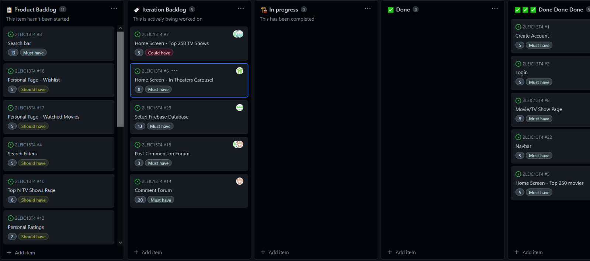

## Iteration 0 Retrospective
### What went well?
Team members were familiar with Figma and did the mockups without any problems. Sérgio was responsile for the initial prototype (hard coded version of some pages) and also did a great job. Every member worked for the success of the team (doing different tasks).

### What didn't go so well?
The team didn't do a great job on the domain model. The product vision could still be improved

### What have we learned?
We learned to setup and take the first steps in Flutter. We also learned how to properly prototype with Figma and work together as a team.

### What still puzzles us?
Some user stories and acceptance tests still aren't precise enough

## Iteration 1 Sprint Planning

## Iteration 1 Retrospective
### What went well?
We were very proud because we managed to complete all the issues in our Sprint successfully. The work load wasn't overwhelming and everything went relatively smoothly.

### What didn't go so well?
We encountered a few bugs regarding the integration with the API. Nothing majorly disruptive, but frustrating still. We also discovered there's a limit of 100 API queries per day.

### What have we learned?
How to sucessfully use the IMDb API and the concept of 'Future Object' and 'Async Functions' in Flutter.

### What still puzzles us?
How we are going to deal with the limit of 100 queries without it negatively impacting our work.

## Iteration 2 Sprint Planning

## Iteration 2 Retrospective
### What went well?
The firebase database setup wasn't as hard as we thought initially.

### What didn't go so well?
The API was constantly running out of requests, which made us create several accounts. We also had dificulties understanding how to use Gherkin to test our project.

### What have we learned?
We learned how to get and set data on the firebase database and a little bit of testing.

### What still puzzles us?
Testing with Gherkin is still a bit confusing.

## Iteration 3 Sprint Planning

## Iteration 3 Retrospective
### What went well?
Reply to comments feature was easier to implement than expected. We also changed the API...

### What didn't go so well?
...

### What have we learned?
...

### What still puzzles us?
...
